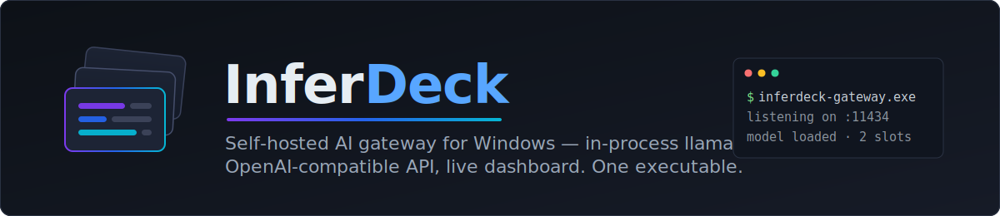

<div align="center">



<br/>

[](https://en.cppreference.com/w/cpp/23)
[](#build-from-source)
[](https://github.com/ggml-org/llama.cpp)
[](#api-surface)
[](#live-dashboard)
[](LICENSE)

**A single C++23 executable that runs LLMs in-process via [llama.cpp](https://github.com/ggml-org/llama.cpp),
exposes OpenAI- and Anthropic-compatible APIs on `:11434`, and serves a live React dashboard on the same port.**

[Features](#features) · [Architecture](#architecture) · [Quick start](#quick-start) · [API](#api-surface) · [Roadmap](#roadmap) · [Docs](#documentation)

</div>

<!-- TODO(assets): dashboard screenshot — drop a capture of the Overview page at
     docs/assets/dashboard-overview.png and uncomment:

<p align="center">
  
</p>
-->

---

## Why InferDeck

My "AI server" is also my gaming and dev PC — a Windows machine upgraded with
a Radeon AI PRO R9700. I wasn't willing to switch it to Linux or maintain a
dual boot just to serve models, and I was already building
[Universal Agent Manager](https://github.com/davidtaylor6130/Universal-Agent-Manager),
which needed a local inference backend it could control over the network and
trust to run unattended.

None of the existing options fit that setup. **LM Studio**'s server ate too
much system RAM. **Ollama** was slow and a faff to control programmatically.
Raw **llama-server.exe** generates well but is hard to manage over the
network. **vLLM** is built for a different scale than a single-GPU Windows
box. So I built my own gateway that matches `llama-server.exe`'s behaviour
token-for-token — the ≥ 0.95 parity gate in CI exists for exactly this
reason — while adding the control layer the others lacked. It was also a
welcome excuse to get back into a serious modern-C++ project.

The guiding idea is simple: **one GPU, fully under your control, never
dropping work.** Most local-LLM setups on Windows are a stack of loosely
coupled processes — a server binary, a proxy, a separate UI, and a script that
restarts whatever fell over — and when two clients hit the GPU at once, one of
them usually just fails. InferDeck collapses all of that into **one process**
where every model is managed from the dashboard and overlapping requests are
**queued and scheduled, not rejected**: built to run unattended on a
single-GPU workstation and serve coding agents (opencode, Open WebUI,
Claude-style clients) around the clock.

It links `llama.dll` and drives the llama.cpp C API directly — no
`llama-server.exe` subprocess, no proxying, no orphan processes — and wraps it
with the operational layer that raw llama.cpp doesn't have: hot model swapping,
KV-cache reuse across agent turns, request history, cost tracking, and a
real-time dashboard.

Text generation is the first modality, not the last. The longer-term goal is a
single gateway where **one GPU time-shares every local AI workload** — LLM
inference, speech-to-text, text-to-speech, image and video generation, and
post-training/quantization jobs — all behind the same API, the same scheduler,
and the same dashboard. See the [roadmap](#roadmap).

> [!NOTE]
> InferDeck is a working daily-driver, but it's also deliberately a
> **learning project**. Part of the goal is to explore the problem space, so
> some subsystems take the experimental route where a boring, conventional one
> would do — that's a feature, not an accident. The parity gate and test
> suites are there to keep the experiments honest.

## Features

### Inference engine
- **In-process llama.cpp (Vulkan).** Direct C-API integration; the only helper
  subprocess is an optional ADLX GPU-telemetry probe.
- **Multi-model with async hot swap.** Models register in
  `config/gateway.yml`; one is resident at a time (single-GPU VRAM budget).
  `POST /v1/swap/to/:name` drains active requests, unloads, loads the new
  GGUF, and streams progress to the dashboard over SSE — with cancellation.
- **KV-cache reuse.** Longest-common-prefix prompt matching, so multi-turn
  agent sessions don't re-prefill the whole conversation each turn.
- **Vision-capable.** mmproj projectors stay resident for multimodal models.

### API
- **OpenAI-compatible** `POST /v1/chat/completions`: SSE streaming,
  tool calls, `reasoning_content`, llama-server-style prompt truncation on
  context overflow instead of a hard error.
- **Anthropic Messages API** at `POST /v1/messages`.
- Discovery and ops endpoints: `/v1/models`, `/v1/health`, `/v1/metrics`.

### Live dashboard
React 19 + Vite + Tailwind, driven by a single SSE stream — no polling:
GPU utilisation/VRAM/temperature/power sparklines, per-request
tokens-per-second, swap progress with cancel, token/cost tracking with
per-model pricing, and a live log viewer.

### Observability & quality
- Every request and swap is recorded three ways: in-memory metrics, SQLite
  history (`stats.db`), and SSE events. p50/p95 latency, daily/hourly usage
  buckets, lifetime counters.
- **Parity-tested:** a CI gate checks ≥ 0.95 LCS token similarity against raw
  `llama-server` per registered model, plus Catch2 unit/integration suites and
  a streaming tool-call harness.
- **Sampler optimization harness** (`inferdeck-bench`) for per-model sampler
  tuning against benchmark tasks.

## Architecture

```
              ┌──────────────────────── inferdeck-gateway.exe ───────────────────────┐
  HTTP :11434 │  libs/gateway        /v1 routes, /api dashboard routes, SSE,        │
  ────────────▶                      streaming sanitizer, SwapTracker, auth, CORS   │
              │  libs/model          ModelRegistry + BackendCoordinator (slots,     │
              │                      drain-on-swap, 30s acquisition queue)          │
              │  libs/llama_cpp_wrapper  LlamaCppModel: template/tokenize/decode/   │
              │                      sample, LCP prompt-cache reuse                 │
              │  libs/observability  GPU telemetry (PDH/DXGI/ADLX), Metrics,        │
              │                      SQLite StatsDb                                 │
              │  libs/foundation     logging, Result/Error, EventBus                │
              └──────────────────────────────┬───────────────────────────────────────┘
                                             │ links
                                      llama.cpp (Vulkan)
```

**Request flow:** route handler parses the OpenAI body → `BackendCoordinator`
hands out a slot → streaming inference runs on a dedicated thread, pushing
deltas through a condition-variable-guarded queue into the chunked HTTP
response → metrics + SQLite + SSE event on completion. The coordinator never
holds its mutex during inference, so status endpoints and second slots stay
responsive mid-generation.

<details>
<summary><b>Repository layout</b></summary>

```
apps/inferdeck-gateway/    exe entry: config, dependency wiring, routes, static files
apps/dashboard/            React dashboard (built output is committed and served by the exe)
apps/benchmark-runner/     inferdeck-bench sampler-optimization harness
apps/hardware-adlx-helper/ optional GPU telemetry helper
libs/                      gateway, model, llama_cpp_wrapper, observability, optimize, foundation
config/                    gateway.yml, per-model sampler profiles
tests/                     Catch2 unit/integration, parity gate, fixtures, stress
docs/                      API reference, architecture notes, deploy guide
```

</details>

## Quick start

### Prerequisites

- Windows 10/11 x64, a Vulkan-capable GPU
- Visual Studio 2022 (MSVC, C++23), CMake ≥ 3.27, vcpkg, Vulkan SDK
- Node.js + pnpm (dashboard only)

llama.cpp is cloned into `libs/third_party/` (not a submodule).

### Build from source

```bash
cmake -S . -B build -G "Visual Studio 17 2022" -A x64 -DINFERDECK_BUILD_TESTS=ON
cmake --build build --target inferdeck-gateway --config Release -j

# Dashboard (output lands in apps/inferdeck-gateway/static/)
pnpm install
pnpm --filter dashboard build
```

### Run

```bash
# 1. Download GGUF model(s) and point config/gateway.yml#model_registry at them
# 2. Start the gateway
./build/bin/Release/inferdeck-gateway.exe

# 3. Verify
curl http://localhost:11434/v1/models
curl http://localhost:11434/v1/health
# Dashboard: http://localhost:11434/
```

Point any OpenAI-compatible client at `http://localhost:11434/v1` with any API
key — for example:

```bash
curl http://localhost:11434/v1/chat/completions \
  -H "Content-Type: application/json" \
  -d '{"model": "qwen3-coder-next", "messages": [{"role": "user", "content": "Hello!"}], "stream": true}'
```

### Test

```bash
# C++ unit + integration
ctest --test-dir build -C Release --output-on-failure -L "unit|integration"

# Dashboard unit tests
pnpm --filter dashboard test

# Parity gate vs raw llama-server (slow, needs real GGUFs)
bash tests/parity/run.sh
```

## API surface

| Endpoint | Notes |
| --- | --- |
| `POST /v1/chat/completions` | OpenAI-compatible; SSE streaming, tool calls, reasoning content |
| `POST /v1/messages` | Anthropic Messages API |
| `GET /v1/models` · `/v1/health` · `/v1/metrics` | discovery + ops |
| `POST /v1/swap/to/:name` | async swap, `202` + SSE progress; `/v1/swap/cancel`, `/v1/swap/status` |
| `GET /api/status` · `/api/jobs` · `/api/logs` · `/api/pricing` | dashboard data |
| `GET /api/events/stream` | SSE: `stats` (~1 Hz), `model`, `request` events |

## Roadmap

The destination: **one GPU, every modality, zero dropped requests** — a single
gateway that schedules all local AI workloads the way it schedules chat
completions today.

**Hardening the core**
- [ ] **Durable request queue** across all workloads — overlapping calls wait
  their turn (with queue position surfaced in the dashboard) instead of being
  rejected, even across model swaps.
- [ ] **Recurrent-state checkpoints** for hybrid linear-attention models
  (e.g. Qwen3.6-A3B), so they get the same KV-cache reuse as full-attention
  models instead of re-prefilling every turn.
- [ ] **Structured error codes** across the API surface and UTF-8 hold-back in
  the streaming path for clean multi-byte output.
- [ ] **GitHub Actions CI** running the unit/integration suites on every push.

**Beyond text — the multi-modal gateway**
- [ ] **Speech-to-text** (`/v1/audio/transcriptions`, whisper.cpp) and
  **text-to-speech** (`/v1/audio/speech`) behind the same slot scheduler.
- [ ] **Image generation** (`/v1/images/generations`, stable-diffusion.cpp) —
  the swap machinery already handles "unload the LLM, load something else."
- [ ] **Video generation** as local open-model pipelines mature — long-running
  jobs with progress streamed over the existing SSE channel.
- [ ] **Post-training & quantization jobs** — GGUF quantization and LoRA
  fine-tuning launched and monitored from the dashboard, queued into GPU idle
  time alongside inference.

**Expanding the engine**
- [ ] **Speculative decoding** (draft-model and MTP) once it coexists with
  parallel slots.
- [ ] **Embeddings endpoint** (`/v1/embeddings`) for local RAG pipelines.
- [ ] **Dual-model residency** on high-VRAM and multi-GPU machines — serve a
  small fast model alongside the large one with no swap latency.
- [ ] **Automated sampler tuning** end-to-end: Optuna-driven per-model profiles
  promoted from `inferdeck-bench` runs with one click in the dashboard.

**Expanding the platform**
- [ ] **Linux support** — the inference core is portable; the GPU telemetry
  layer (PDH/DXGI/ADLX) needs a sysfs/NVML equivalent.
- [ ] **Multi-user mode** — API keys, per-key usage attribution, and rate
  limits, so one workstation can serve a small team.
- [ ] **Remote fallback routing** — optionally proxy requests to a cloud
  provider when the local model is mid-swap or over capacity.

Suggestions and issues are welcome — see [CONTRIBUTING.md](CONTRIBUTING.md).

## Documentation

| Doc | Contents |
| --- | --- |
| [`AGENTS.md`](AGENTS.md) | Engineering guide: build/test commands, architecture quick reference, concurrency invariants, design rules learned the hard way |
| [`docs/architecture.md`](docs/architecture.md) | Layer-by-layer architecture notes |
| [`docs/DEPLOY.md`](docs/DEPLOY.md) | Unattended Windows deployment (scheduled tasks + watchdog) |
| [`docs/opencode-setup-guide.md`](docs/opencode-setup-guide.md) | Pointing opencode at InferDeck |
| [`CHANGELOG.MD`](CHANGELOG.MD) | Release history |

## Acknowledgements

InferDeck stands on [llama.cpp](https://github.com/ggml-org/llama.cpp) by
Georgi Gerganov and contributors — the parity gate exists precisely because
matching its quality is the bar.

## License

[MIT](LICENSE)
