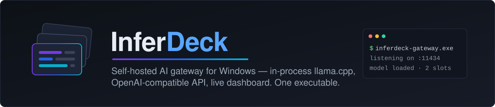

<div align="center">



<br/>

[](https://en.cppreference.com/w/cpp/23)
[](#build-from-source)
[](https://github.com/ggml-org/llama.cpp)
[](#api-surface)
[](#live-dashboard)
[](LICENSE)

**A single C++23 executable that runs LLMs in-process via [llama.cpp](https://github.com/ggml-org/llama.cpp),
exposes an OpenAI-compatible API on `:11434`, and serves a live React dashboard on the same port.**

[Features](#features) · [Architecture](#architecture) · [Quick start](#quick-start) · [API](#api-surface) · [Roadmap](#roadmap) · [Docs](#documentation)

</div>

---

## Why InferDeck

My "AI server" is also my gaming and dev PC, a Windows machine upgraded with
a Radeon AI PRO R9700. I wasn't willing to switch it to Linux or maintain a
dual boot just to serve models, and I was already building
[Universal Agent Manager](https://github.com/davidtaylor6130/Universal-Agent-Manager),
which needed a local inference backend it could control over the network and
trust to run unattended.

None of the existing options fit that setup. **LM Studio**'s server ate too
much system RAM. **Ollama** was slow and a faff to control programmatically.
Raw **llama-server.exe** generates well but is hard to manage over the
network. **vLLM** is built for a different scale than a single-GPU Windows
box. So I built my own gateway that aims to retain `llama-server.exe`'s
response quality, with a manually provisioned parity harness for comparison,
while adding the control layer the others lacked. It was also a welcome excuse
to get back into a serious modern-C++ project.

The guiding idea is simple: **one GPU, fully under your control, with
overlapping work queued.** My first attempt was a bodged-together stack of a
server binary, proxy, separate UI, and a script that restarted whatever fell
over. It proved the idea, but it was awkward to operate reliably. InferDeck is
the deliberate replacement: **one process** where every model is managed from
the dashboard and overlapping requests are **queued and scheduled, not
rejected**. It is built to run unattended on a single-GPU workstation and
serve coding agents (opencode, Open WebUI, Claude-style clients) around the
clock.

It links `llama.dll` and drives the llama.cpp C API directly, with no
`llama-server.exe` subprocess, proxying, or orphan processes. It wraps this
with the operational layer that raw llama.cpp doesn't have: hot model swapping,
KV-cache reuse across agent turns, request history, cost tracking, and a
real-time dashboard.

Text generation is the first modality, not the last. The longer-term goal is a
single gateway where **one GPU time-shares every local AI workload**: LLM
inference, speech-to-text, text-to-speech, image and video generation, and
post-training/quantisation jobs, all behind the same API, the same scheduler,
and the same dashboard. See the [roadmap](#roadmap).

> [!NOTE]
> InferDeck is a working daily-driver, but it's also deliberately a
> **learning project**. Part of the goal is to explore the problem space, so
> some subsystems take the experimental route where a boring, conventional one
> would do. That is a feature, not an accident. The parity harness and test
> suites are there to keep the experiments honest.

## Features

### Inference engine

- **In-process llama.cpp (Vulkan).** Direct C-API integration with no backend
  subprocess, proxy, or orphan process.
- **Multi-model residency with async hot swap.** Models register in
  `config/gateway.yml`; the coordinator admits resident models within the
  configured single-GPU VRAM budget.
  `POST /api/inferdeck/v1/swap/to/:name` drains active requests, unloads, loads the new
  GGUF, and streams progress to the dashboard over SSE, with cancellation.
- **KV-cache reuse.** Longest-common-prefix prompt matching, so multi-turn
  agent sessions reuse full-attention KV state and hybrid recurrent
  checkpoints instead of re-prefilling the whole conversation each turn.
- **Honest modality discovery.** Text models advertise text input only until
  the in-process multimodal projector path is implemented.

### API

- **OpenAI-compatible** `POST /v1/chat/completions`: SSE streaming,
  tool calls, and llama-server-style prompt truncation on
  context overflow instead of a hard error.
- **OpenAI Responses and embeddings APIs** at `POST /v1/responses` and
  `POST /v1/embeddings`. Responses is stateless; unsupported storage,
  background, and conversation fields are rejected explicitly.
- **Strict OpenAI Core.** `/v1` exposes only the pinned OpenAI surface.
  OpenAI-derivative and non-OpenAI routes are not registered.
- **Native audio APIs.** CPU-only Parakeet
  TDT 0.6B v3 transcription at `POST /v1/audio/transcriptions` and in-process
  Supertonic 3 speech synthesis at `POST /v1/audio/speech` are release-built
  and live-verified end to end.
- **Experimental image generation API.** A compile-gated
  stable-diffusion.cpp path exists at `POST /v1/images/generations`, but it has
  not yet been thoroughly tested end to end.
- Discovery and operations endpoints: `GET /v1/models`, `GET /api/inferdeck/v1/health`,
  `GET /api/inferdeck/v1/metrics`, and `GET /api/inferdeck/v1/stats/history`.

### Live dashboard

React 19 + Vite + Tailwind, driven by one SSE connection with a bounded
30-second status fallback. The task views separate Model Settings from model
catalogue, installed-artifact management, server-owned usage pricing, and
diagnostics. Voice
capture and playback belong to API clients such as Open WebUI, not the
administration dashboard.

Loopback dashboard access is passwordless. LAN and encrypted-overlay access
requires remote control to be enabled, an exact `control.origins` entry, and
the separate control token. The browser exchanges that token for an HTTP-only,
same-site session cookie so native SSE and administrative actions remain
authenticated.

### Observability & quality

- Every request and swap is recorded three ways: in-memory metrics, SQLite
  history (`stats.db`), and SSE events. p50/p95 latency, daily/hourly usage
  buckets, generation TPS, prompt TPS, measured peak TPS, and lifetime counters.
- Catch2 unit/integration suites and a streaming tool-call harness cover API
  shape and runtime behaviour. Real-model parity remains a manually provisioned
  hardware test.
- `build/bin/Release/inferdeck-bench.exe --dry-run` validates search-space
  parsing and optimiser mechanics. The dashboard can run measured, fixed-seed
  quality and throughput benchmarks before staging a model profile for
  validation and hot application.

## Architecture

```
              ┌──────────────────────── inferdeck-gateway.exe ───────────────────────┐
  HTTP :11434 │  libs/gateway        /v1 routes, /api dashboard routes, SSE,        │
  ────────────▶                      streaming sanitizer, SwapTracker, auth, CORS   │
              │  libs/model          ModelRegistry + BackendCoordinator (slots,     │
              │                      drain-on-swap, priority/ageing queue)           │
              │  libs/llama_cpp_wrapper  LlamaCppModel: template/tokenize/decode/   │
              │                      sample, LCP prompt-cache reuse                 │
              │  libs/observability  GPU telemetry (PDH/DXGI), Metrics,             │
              │                      SQLite StatsDb                                 │
              │  libs/foundation     logging, Result/Error, EventBus                │
              └──────────────────────────────┬───────────────────────────────────────┘
                                             │ links
                                      llama.cpp (Vulkan)
```

**Request flow:** route handler parses the OpenAI body → `BackendCoordinator`
hands out a slot → streaming inference runs on a dedicated thread, pushing
deltas through a condition-variable-guarded queue into the chunked HTTP
response → metrics + SQLite + SSE event on completion. The coordinator never
holds its mutex during inference, so status endpoints and second slots stay
responsive mid-generation.

<details>
<summary><b>Repository layout</b></summary>

```
apps/inferdeck-gateway/    exe entry: config, dependency wiring, routes, static files
apps/dashboard/            React dashboard (built output is committed and served by the exe)
apps/benchmark-runner/     inferdeck-bench sampler-optimisation harness
apps/hardware-adlx-helper/ standalone ADLX probe experiment; not launched by the gateway
libs/                      gateway, model, llama_cpp_wrapper, observability, optimize, foundation
config/                    gateway.yml, per-model sampler profiles
tests/                     Catch2 integration and parity suites, plus request fixtures
Testing/                   manual streaming, overflow, compaction, and cache-reuse harnesses
docs/                      API reference, architecture notes, deploy guide
```

</details>

## Quick start

### Clone

`llama.cpp` and `Vulkan-Headers` are pinned Git submodules:

```bash
git clone --recurse-submodules https://github.com/davidtaylor6130/InferDeck.git
cd InferDeck
```

If the repository was cloned without submodules, initialise them before
configuring the build:

```bash
git submodule update --init --recursive
```

### Prerequisites

- Windows 10/11 x64, a Vulkan-capable GPU
- Visual Studio 2022 (MSVC, C++23), CMake ≥ 3.27, Vulkan SDK, and vcpkg
  with `VCPKG_ROOT` set
- Node.js 22 + pnpm 9 (dashboard only)

### Build from source

```powershell
cmake -S . -B build -G "Visual Studio 17 2022" -A x64 `
  -DCMAKE_TOOLCHAIN_FILE="$env:VCPKG_ROOT/scripts/buildsystems/vcpkg.cmake" `
  -DINFERDECK_BUILD_TESTS=ON
cmake --build build --config Release --parallel

# Dashboard (output lands in apps/inferdeck-gateway/static/)
pnpm install
pnpm --filter dashboard build
```

### Optional speech setup

The active speech models are Parakeet TDT 0.6B v3 and Supertonic 3 through
sherpa-onnx. There is no complete automated setup script for this configuration.
The integration is still experimental and has not yet been thoroughly tested
end to end.
Supply a sherpa-onnx installation prefix containing
`include/sherpa-onnx/c-api/c-api.h`, `lib/sherpa-onnx-c-api.lib`, and the
matching runtime DLLs, then configure with its path:

```powershell
cmake -S . -B build -G "Visual Studio 17 2022" -A x64 `
  -DCMAKE_TOOLCHAIN_FILE="$env:VCPKG_ROOT/scripts/buildsystems/vcpkg.cmake" `
  -DINFERDECK_BUILD_TESTS=ON `
  -DINFERDECK_SHERPA_ONNX_ROOT=C:/path/to/sherpa-onnx-install
```

Download the Parakeet and Supertonic model artefacts separately, then update
their `artifacts` paths in `config/gateway.yml`. The existing
`scripts/setup-whisper-runtime.ps1` installs the optional whisper.cpp fallback;
it does not set up the active Parakeet or Supertonic models.

> [!WARNING]
> The default homelab configuration binds to `0.0.0.0`, disables
> authentication, and allows all CORS origins. Do not expose it directly to
> the public internet. Use it only on a trusted LAN or through a VPN, firewall,
> or properly configured reverse proxy. Enable authentication and restrict
> CORS origins where appropriate.

### Run

```bash
# 1. Download GGUF model(s) and point config/gateway.yml#model_registry at them
# 2. Start the gateway
./build/bin/Release/inferdeck-gateway.exe

# 3. Verify
curl http://localhost:11434/v1/models
curl http://localhost:11434/api/inferdeck/v1/health
# Dashboard: http://localhost:11434/
```

Point an OpenAI-compatible client at `http://localhost:11434/v1`. With the
default authentication setting, clients that require a key may use a
placeholder. When authentication is enabled, send the configured Bearer token.
For example:

```bash
curl http://localhost:11434/v1/chat/completions \
  -H "Content-Type: application/json" \
  -d '{"model": "qwen3-coder-next", "messages": [{"role": "user", "content": "Hello!"}], "stream": true}'
```

### Test

```powershell
# C++ unit + integration
ctest --test-dir build -C Release --output-on-failure -L "unit|integration"

# Dashboard unit tests
pnpm --filter dashboard test

# Pinned OpenAI JavaScript SDK 7.5.0 contract
pnpm test:openai-contract

# Pinned OpenAI Python SDK 3.3.1 contract
python -m pip install -r Testing/requirements-openai-contract.txt
python -m unittest -v Testing.openai_sdk_contract_test

# Real-model parity needs raw llama-server and InferDeck running with the same model
pwsh -File tests/parity/record_baseline.ps1 -Model qwen3.6-27b
pwsh -File tests/parity/run.ps1 `
  -BaselinePath tests/parity/baselines/qwen3.6-27b.jsonl `
  -Model qwen3.6-27b
```

## API surface

| Endpoint | Notes |
| --- | --- |
| `POST /v1/chat/completions` | OpenAI-compatible; SSE streaming and tool calls |
| `POST /v1/responses` | Stateless OpenAI Responses compatibility; streaming, tools, reasoning, and structured output translation |
| `POST /v1/embeddings` | OpenAI-compatible float or base64 embeddings for registered embedding models |
| `POST /v1/audio/transcriptions` | Request-scoped WAV-to-text via native Parakeet TDT or whisper.cpp models |
| `POST /v1/audio/speech` | Request-scoped WAV or PCM output via native Supertonic 3 |
| `POST /v1/images/generations` | Experimental, not yet fully tested; intended to provide base64 PNG generation when stable-diffusion.cpp is linked and an image model is registered |
| `GET /v1/models` · `GET /api/inferdeck/v1/health` · `GET /api/inferdeck/v1/metrics` · `GET /api/inferdeck/v1/stats/history` | model discovery, health, live metrics, and usage history |
| `POST /api/inferdeck/v1/swap/to/:name` | async swap, `202` + SSE progress; `POST /api/inferdeck/v1/swap/cancel`; `GET /api/inferdeck/v1/swap/status` |
| `GET /api/inferdeck/v1/status` · `GET /api/inferdeck/v1/jobs` · `GET /api/inferdeck/v1/logs` · `GET /api/inferdeck/v1/pricing` | dashboard data |
| `GET /api/inferdeck/v1/events/stream` | SSE: `stats` (~1 Hz), `model`, `request` events |
| `GET /api/inferdeck/v1/model-store/search` · `GET /api/inferdeck/v1/model-store/inspect` | dashboard model discovery and artefact inspection |
| `GET /api/inferdeck/v1/model-store/downloads` · `POST /api/inferdeck/v1/model-store/downloads` | list or start downloads |
| `POST /api/inferdeck/v1/model-store/downloads/:id/cancel` · `POST /api/inferdeck/v1/model-store/downloads/:id/resume` | cancel or resume a download |
| `POST /api/inferdeck/v1/model-store/remove` | remove an inactive model-store entry and its managed artefact |

## Roadmap

The destination is **one GPU with shared scheduling for every modality**: a
single gateway that manages local AI workloads the way it manages chat
completions today.

**Hardening the core**
- [x] **Shared request queue** across text, embeddings, image, speech, and
  transcription. It supports priorities with ageing, cancellation, queue
  position reporting, and preparation across model swaps. It is in memory, not
  durable across gateway restarts.
- [x] **Recurrent-state checkpoints** for hybrid linear-attention models
  (e.g. Qwen3.6-A3B), so they get the same KV-cache reuse as full-attention
  models instead of re-prefilling every turn.
- [x] **Structured error codes and UTF-8 hold-back** in the streaming paths for
  clean multi-byte output and consistent API errors.
- [x] **Required CI on every push and pull request.** Architecture policy,
  dashboard/SDK contracts, and clean native build/security gates run separately
  from release packaging.

**Beyond text: the multimodal gateway**
- [ ] **Speech-to-text** (`/v1/audio/transcriptions`, Parakeet TDT). The route
  and optional sherpa-onnx integration exist, but end-to-end testing is still
  outstanding.
- [ ] **Text-to-speech** (`/v1/audio/speech`, Supertonic 3). The route and
  optional sherpa-onnx integration exist, but end-to-end testing is still
  outstanding.
- [ ] **Image generation API and adapter** (`/v1/images/generations`). The
  compile-gated stable-diffusion.cpp path exists, but the dependency and model
  are not bundled and end-to-end testing is still outstanding.
- [ ] **Video generation** as local open-model pipelines mature, using
  long-running jobs with progress streamed over the existing SSE channel.
- [ ] **Post-training and quantisation jobs**, including GGUF quantisation and LoRA
  fine-tuning launched and monitored from the dashboard, queued into GPU idle
  time alongside inference.

**Expanding the engine**
- [x] **True parallel slots (continuous batching).** Decode multiple concurrent
  requests against one resident model in a single batched `llama_decode` loop
  (one shared context, `n_seq_max` sequences) instead of serialising them behind
  a per-model lock, turning the slot queue into real concurrency.
- [x] **OpenAI Responses API** (`/v1/responses`) for stateless text input,
  tools, reasoning, structured outputs, and typed streaming events. Vision is
  still rejected because no model can currently advertise vision support.
- [x] **Embeddings endpoint** (`/v1/embeddings`) for local RAG pipelines.
- [x] **Adaptive MTP decoding** for configured Qwen3.6 models at low
  concurrency, with ordinary continuous batching used outside the MTP window.
- [ ] **Draft-model speculative decoding.** Only MTP is implemented.
- [x] **Multi-model residency** when the detected or configured VRAM budget can
  fit more than one model, with conservative single-resident behaviour when no
  budget is known.
- [x] **Measured profile optimisation** using the in-house search and dashboard
  benchmark flow. It measures quality, throughput, load time, and peak VRAM
  before staging the recommended configuration.

**Expanding the platform**
- [x] **Integrated model store** for Hugging Face discovery, verified downloads,
  cancellation/resume, registration, and safe removal on Windows.
- [ ] **Linux support.** The inference core is portable; the GPU telemetry
  layer (PDH/DXGI/ADLX) needs a sysfs/NVML equivalent.
- [ ] **Multi-user mode.** The current authentication setting is one shared
  Bearer token, without per-key usage attribution or rate limits.
- [ ] **Remote fallback routing**, optionally proxying requests to a cloud
  provider when the local model is mid-swap or over capacity.

Suggestions and issues are welcome. See [CONTRIBUTING.md](CONTRIBUTING.md).

## Documentation

| Doc | Contents |
| --- | --- |
| [`AGENTS.md`](AGENTS.md) | Engineering guide: build/test commands, architecture quick reference, concurrency invariants, design rules learned the hard way |
| [`docs/architecture.md`](docs/architecture.md) | Layer-by-layer architecture notes |
| [`docs/DEPLOY.md`](docs/DEPLOY.md) | Unattended Windows deployment (scheduled tasks + watchdog) |
| [`docs/opencode-setup-guide.md`](docs/opencode-setup-guide.md) | Pointing opencode at InferDeck |
| [`CHANGELOG.MD`](CHANGELOG.MD) | Release history |

## Acknowledgements

InferDeck stands on [llama.cpp](https://github.com/ggml-org/llama.cpp) by
Georgi Gerganov and contributors. The parity gate exists precisely because
matching its quality is the bar.

## License

[MIT](LICENSE)
